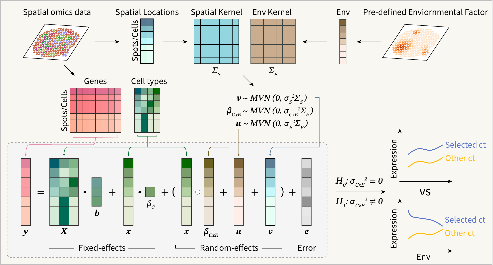

<p align="center">
  
</p>

# CYGNET

CYGNET tests cell-type-by-environment interaction effects in spatial
transcriptomics data. It provides variance-component score tests, random
Fourier feature kernels, permutation calibration, AnnData integration, and
spot-level composition preprocessing.

## Requirements

CYGNET supports Python 3.9 through 3.13. Its core Python dependencies are
declared in [`pyproject.toml`](pyproject.toml): `chiscore`, `joblib`,
`matplotlib`, `numpy`,
`pandas`, `scikit-learn`, `scipy`, `seaborn`, `statsmodels`, and `tqdm`.

R is optional:

- [`mgcv`](https://cran.r-project.org/package=mgcv) is required only for the
  R-backed nonlinear environment transform.
- [`SpotClean`](https://bioconductor.org/packages/SpotClean) and its companion
  packages are required only for optional 10x Visium decontamination.

## Installation from GitHub

For a reproducible Python and R/`mgcv` environment, clone the repository and
use the supplied conda environment:

```bash
git clone https://github.com/yt-pan/CYGNET.git
cd CYGNET
conda env create -f environment.yml
conda activate cygnet
python -m pip install .
```

For the core Python package only, pip can install the tagged release directly
from GitHub:

```bash
python -m pip install "cygnet @ git+https://github.com/yt-pan/CYGNET.git@1.0.0"
```

To include [AnnData](https://anndata.readthedocs.io/) support:

```bash
python -m pip install "cygnet[anndata] @ git+https://github.com/yt-pan/CYGNET.git@1.0.0"
```

For an editable development install from a clone:

```bash
python -m pip install -e ".[test,docs]"
```

### Optional R dependencies

Install R and `mgcv` with conda:

```bash
conda install -c conda-forge r-base r-mgcv
```

Alternatively, install `mgcv` from R:

```r
install.packages("mgcv", repos = "https://cloud.r-project.org")
```

For the optional SpotClean workflow, run the repository installer using the
same `Rscript` executable that CYGNET will use:

```bash
Rscript scripts/install_spotclean.R
```

The script installs
[`SpotClean`](https://bioconductor.org/packages/SpotClean),
[`SpatialExperiment`](https://bioconductor.org/packages/SpatialExperiment),
[`Seurat`](https://satijalab.org/seurat/articles/install_v5.html), and
[`sctransform`](https://cran.r-project.org/package=sctransform). Set
`CYGNET_RSCRIPT` to the full path of `Rscript` if it is not available on
`PATH`.

## Quick start

```python
import anndata as ad
import cygnet

adata = ad.read_h5ad("data.h5ad")

result = cygnet.run_cygnet_pipeline_from_anndata(
    adata,
    environment="environment",
    celltypes="celltype",
    spatial_key="spatial",
    n_permutations=10,
    n_jobs=8,
    store_key="cygnet",
)

result.results.to_csv("cygnet_results.csv", index=False)
```

For a categorical `obs` column, CYGNET constructs cell-type indicators. For
spot-level data, pass numeric cell-type composition columns or an `obsm`
matrix after applying the CLR preprocessing helpers.

Article-compatible kernel and empirical-calibration policies are available
explicitly:

```python
result = cygnet.run_cygnet_pipeline_from_anndata(
    adata,
    environment="environment",
    celltypes="celltype",
    gamma_spatial_method="manuscript_range",
    permutation_ecdf_method="manuscript_interpolation",
    random_state=1,
)
```

The package defaults use the inverse median squared-distance gamma and the
plus-one finite-permutation ECDF.

## Documentation and validation

- [Installation](docs/INSTALL.md)
- [Tutorial](docs/TUTORIAL.md)
- [Pipeline reference](docs/PIPELINE.md)
- [Plotting](docs/PLOTTING.md)
- [Validation](docs/VALIDATION.md)

Run the regression suite with:

```bash
python -m pytest -q
python scripts/benchmark_reference.py
```

## License

CYGNET is distributed under the MIT License.
